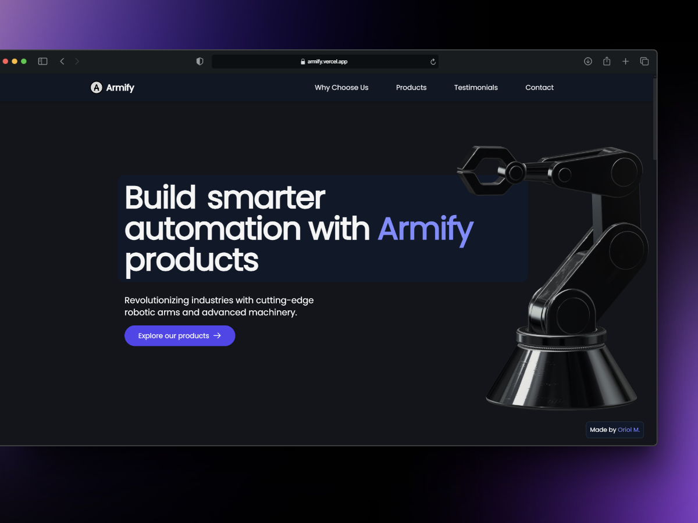
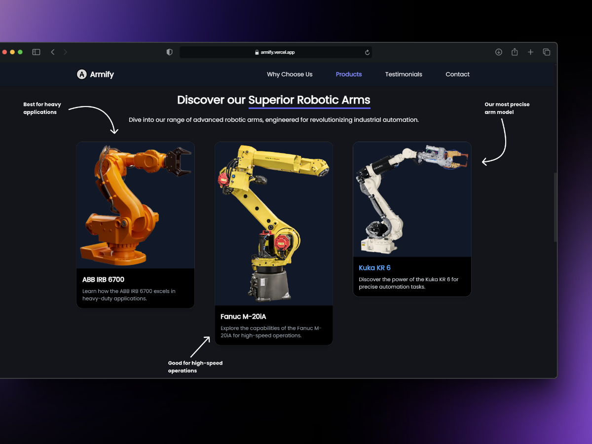
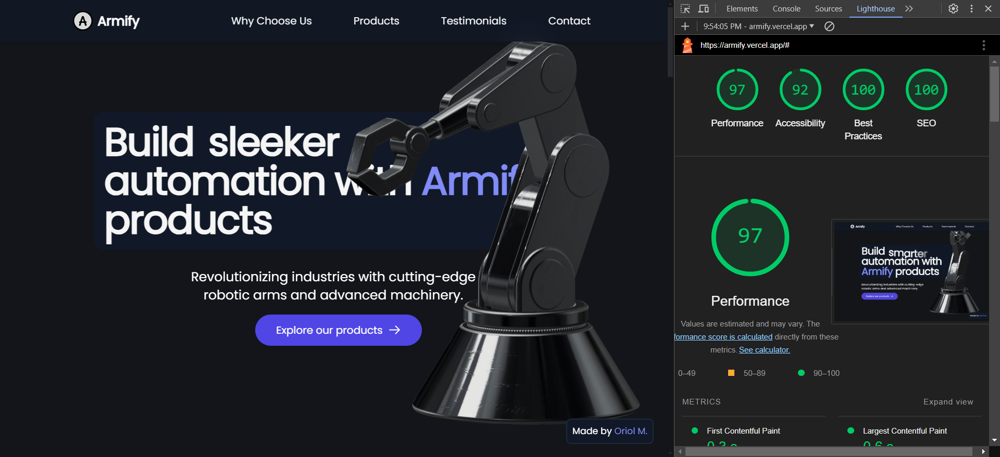

# 🦾 Armify: Lending a Hand in Industrial Automation 🏭

Welcome to the Armify project repository! We're here to show you how we're arming the future of industry with cutting-edge robotic solutions.

## 🤖 About Armify

Armify is a `showcase project` demonstrating a landing page for a fictional company specializing in robotic industrial arms. While our company might be make-believe, the technology behind it is very real!

## 🛠 Technologies Used

We've assembled quite the tech stack to bring Armify to life:

- **Astro** 🚀: Our cosmic companion for building fast, content-focused websites
- **React** ⚛️: The atomic powerhouse of our UI components
- **Tailwind CSS** 💨: Styling at the speed of light
- **Framer Motion** 🎭: Bringing our page to life with smooth animations
- **Spline Viewer** 📷: A 3D visualization tool for creating/viewing 3D models

## 🎯 Project Purpose

This project serves as a demonstration of modern web development techniques and best practices. It showcases how these powerful technologies can be combined to create a sleek, performant, and engaging landing page for a tech-focused company.

## 🚀 Getting Started

To get this project up and running on your local machine, follow these steps:

1. Clone the repository
2. Install dependencies with `npm install`
3. Run the development server with `npm run dev`
4. Open your browser and navigate to `http://localhost:4321`

## 📜 Disclaimer

Armify is a fictional company created for demonstration purposes only. Any resemblance to real companies, living or dead, is purely coincidental.

## 🤝 Contributing

While Armify isn't a real company, your contributions to this project are real and valued! Feel free to open issues or submit pull requests if you have ideas for improvements.
